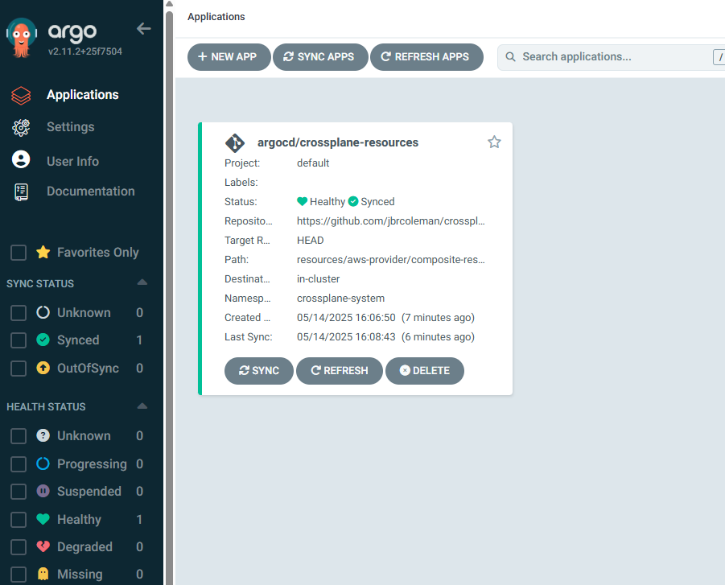
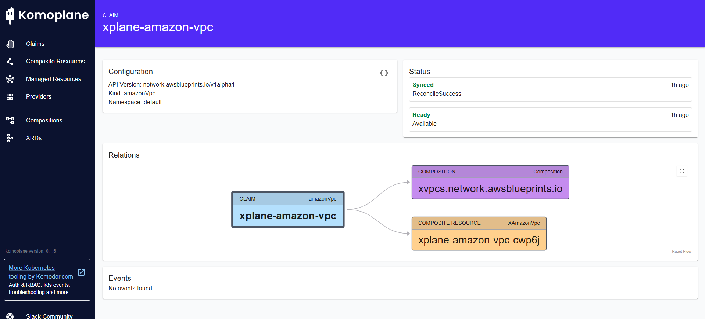

# Crossplane on EKS

This repository demonstrates how to set up Crossplane on Amazon EKS to provision and manage AWS resources using Kubernetes APIs. It uses Terraform to bootstrap the EKS cluster and install necessary components, and then showcases infrastructure-as-code using Crossplane compositions.




## Architecture

This project creates:

- EKS cluster with managed node groups
- VPC with public and private subnets
- Crossplane installation with AWS providers
- ArgoCD for GitOps workflow
- Prometheus and Grafana for monitoring
- Komoplane for Crossplane visualization

## Prerequisites

- AWS CLI configured with appropriate permissions
- Terraform 1.3+
- kubectl
- Helm (optional for manual testing)

## Quick Start

1. Clone the repository:
   ```bash
   git clone https://github.com/jbrcoleman/crossplane-eks.git
   cd crossplane-eks
   ```

2. Initialize and apply the Terraform configuration:
   ```bash
   terraform init
   terraform apply
   ```

3. Configure kubectl to connect to your cluster:
   ```bash
   aws eks update-kubeconfig --name crossplane-blueprints --alias crossplane-blueprints --region us-east-1
   ```

4. Access the ArgoCD UI:
   ```bash
   kubectl get svc -n argocd argocd-server -o jsonpath='{.status.loadBalancer.ingress[0].hostname}'
   ```
   The default username is `admin` and you can get the password with:
   ```bash
   kubectl -n argocd get secret argocd-initial-admin-secret -o jsonpath="{.data.password}" | base64 -d
   ```

5. Access Komoplane for Crossplane visualization:
   ```bash
   kubectl get svc -n komoplane-system komoplane -o jsonpath='{.status.loadBalancer.ingress[0].hostname}'
   ```

## Project Structure

- **terraform/**: Contains Terraform configurations to set up the EKS cluster and install components
  - **main.tf**: Main Terraform configuration file
  - **values/**: Contains Helm values for installed components
  - **providers/**: Contains Crossplane provider configurations
  
- **compositions/**: Contains Crossplane compositions (XRs)
  - **aws-provider/vpc/**: Compositions for AWS VPC resources
  
- **resources/**: Contains example Crossplane resources to deploy
  - **aws-provider/composite-resources/vpc/**: Example VPC resource claims

## Crossplane Resources

The repository includes configurations for several Crossplane resources:

- **VPC Composition**: Define and create Amazon VPCs with customizable parameters
- **AWS Provider**: Connect to AWS and provision resources
- **Composite Resource Definitions**: Define custom resources for your teams

## Monitoring and Visualization

### Prometheus and Grafana

The installation includes Prometheus and Grafana dashboards for monitoring Crossplane, ArgoCD, and EKS.

Access Grafana:
```bash
kubectl get svc -n kube-prometheus-stack kube-prometheus-stack-grafana -o jsonpath='{.status.loadBalancer.ingress[0].hostname}'
```
Default credentials: admin/prom-operator

### Komoplane

Komoplane provides a visualization interface for Crossplane resources. It helps platform teams understand the relationship between Crossplane resources and the actual infrastructure.

Access Komoplane:
```bash
kubectl get svc -n komoplane-system komoplane -o jsonpath='{.status.loadBalancer.ingress[0].hostname}'
```

## Creating Resources with Crossplane

To create a VPC using Crossplane:

1. Apply the VPC claim:
   ```bash
   kubectl apply -f resources/aws-provider/composite-resources/vpc/vpc.yaml
   ```

2. Check the status:
   ```bash
   kubectl get amazonvpc -n default
   ```

3. View in Komoplane or in ArgoCD for a visual representation of the resource.

## Clean Up

To remove all created resources:

```bash
terraform destroy
```
